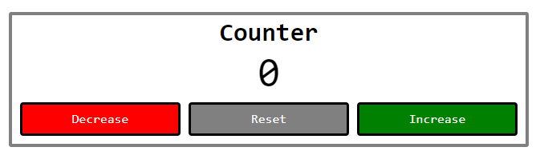

## 📦 Приложение - Счетчик

### 🚀 Обзор

Данный код представляет собой React-компонент для отображения и управления счетчиком. Вот краткое описание кода:

1. Импортируются необходимые зависимости, включая `useState` из библиотеки React.

2. Определен функциональный React-компонент `Counter`, который отвечает за отображение счетчика и управление им.

3. Внутри компонента `Counter`:

   - Используется хук `useState` для создания состояния `counter`, которое хранит текущее значение счетчика (число).
   - Создаются обработчики событий для уменьшения, увеличения и сброса счетчика: `handleDecrease`, `handleIncrease` и `handleReset`.

4. Возвращается JSX-разметка, которая представляет интерфейс счетчика и кнопок для управления им. Счетчик отображается с использованием класса стилей `className`, который был определен ранее.

5. Компонент `Counter` экспортируется для его дальнейшего использования в приложении.

В итоге, данный компонент позволяет отображать счетчик на веб-странице и управлять им.

---

#### 🌄 Превью:

